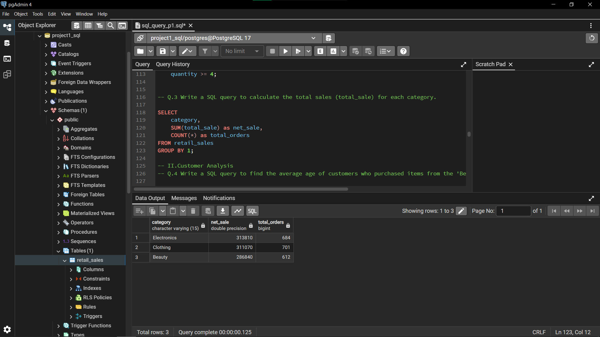
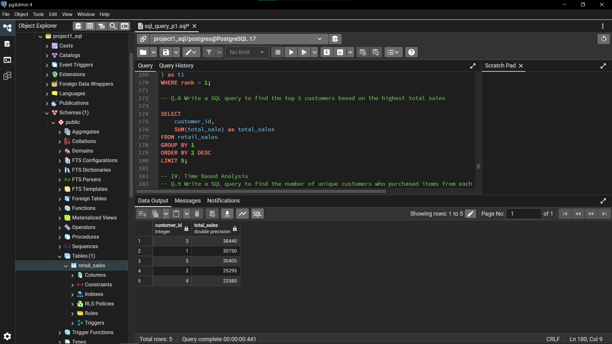
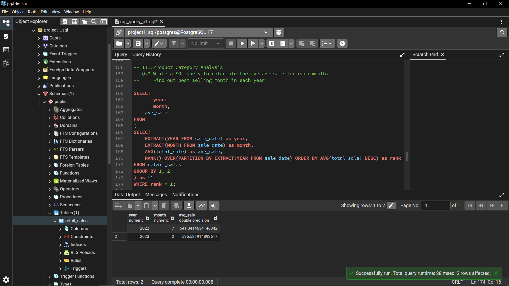
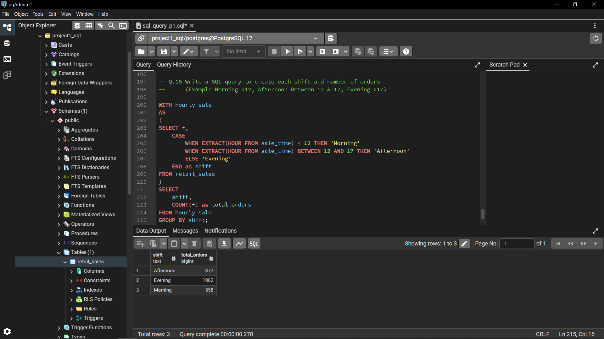

# Retail Sales Analysis using PostgreSQL

## Project Overview

This project analyzes retail sales data using PostgreSQL to uncover insights related to sales performance, customer behavior, product categories, and purchasing trends.

The objective of this project is to demonstrate practical SQL skills by performing data cleaning, exploratory data analysis (EDA), and business-focused analysis using real-world retail transaction data.

---

## Tools & Technologies

* PostgreSQL
* pgAdmin
* SQL

### SQL Concepts Used

* Filtering and Sorting
* Aggregate Functions
* GROUP BY
* Common Table Expressions (CTEs)
* Window Functions
* Date and Time Functions
* Data Cleaning Techniques

---

## Dataset Description

The dataset contains retail transaction records with the following attributes:

| Column         | Description                   |
| -------------- | ----------------------------- |
| transaction_id | Unique transaction identifier |
| sale_date      | Date of purchase              |
| sale_time      | Time of purchase              |
| customer_id    | Unique customer identifier    |
| gender         | Customer gender               |
| age            | Customer age                  |
| category       | Product category              |
| quantity       | Quantity purchased            |
| price_per_unit | Unit selling price            |
| cogs           | Cost of goods sold            |
| total_sale     | Total transaction amount      |

---

## Exploratory Data Analysis (EDA)

Initial exploration was performed to understand the dataset structure and quality.

### EDA Tasks

* Calculated total number of transactions
* Identified unique customers
* Explored available product categories
* Performed data quality checks
* Detected missing values
* Removed incomplete records

---

## Data Cleaning

To improve data quality, records containing missing values in critical fields were identified and removed.

Fields checked included:

* Transaction ID
* Sale Date
* Sale Time
* Gender
* Category
* Quantity
* Cost of Goods Sold (COGS)
* Total Sale

---

## Business Analysis

### I. Sales Performance Analysis

Key questions answered:

* What sales occurred on a specific date?
* Which transactions generated more than $1,000 in sales?
* Which product categories generated the highest revenue?

---

### II. Customer Analysis

Key questions answered:

* What is the average age of customers purchasing Beauty products?
* Who are the top 5 customers by total spending?
* How many unique customers purchased from each category?

---

### III. Product Category Analysis

Key questions answered:

* Which Clothing transactions exceeded a quantity threshold during November 2022?
* How do transaction volumes vary by gender and category?

---

### IV. Time-Based Analysis

Key questions answered:

* Which month generated the highest average sales in each year?
* How are sales distributed across different times of day?

---

## Key Insights

* Certain product categories contribute significantly more revenue than others.
* A small group of customers accounts for a large share of total sales.
* Customer purchasing behavior varies across product categories.
* Sales activity differs throughout the day, revealing peak shopping periods.
* Monthly sales trends can be identified using ranking techniques and time-based analysis.

---

## Project Screenshots

### Dataset Preview

### Sales by Category

### Top Customers by Revenue

### Best Selling Month Analysis

### Sales Shift Analysis

---

## How to Run This Project

1. Create the database in PostgreSQL.
2. Create the `retail_sales` table.
3. Import the dataset.
4. Run the SQL script in pgAdmin.
5. Execute the analysis queries.

---

## Learning Outcomes

Through this project, I practiced:

* Writing complex SQL queries
* Performing business-focused analysis
* Using CTEs and Window Functions

---

## Author

Samuel Rajendran
